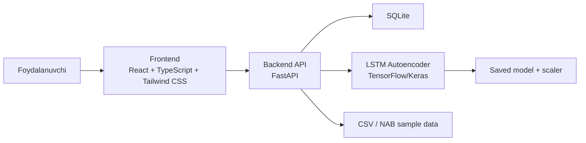
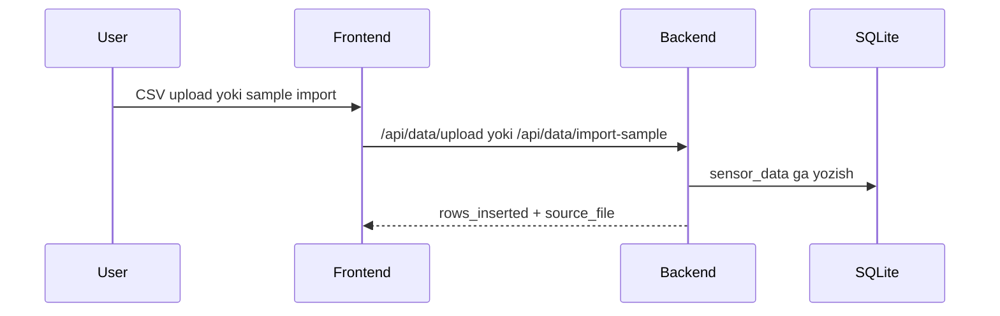
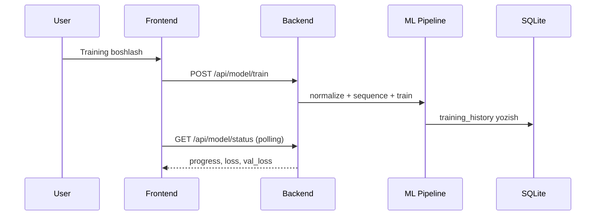
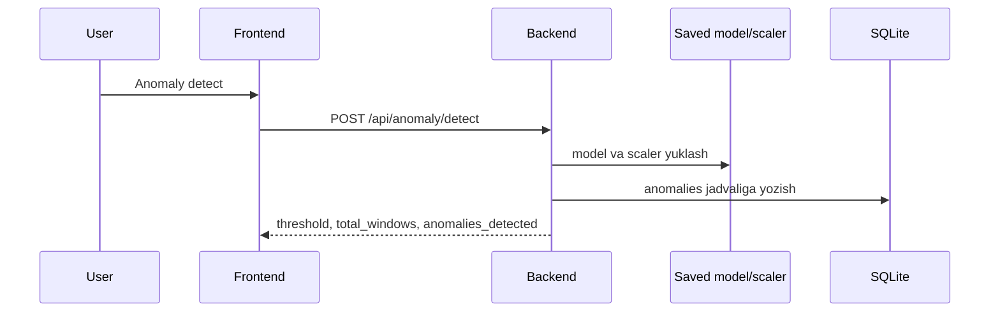

# Architecture

Bu hujjat loyihaning yuqori darajadagi arxitekturasini tushuntiradi.

## Umumiy ko'rinish

## Qatlamlar

### 1. Frontend

Frontend foydalanuvchi bilan ishlaydi:

- Dashboard
- Data Management
- Training
- Analysis

Frontend `Vite proxy` orqali `/api` va `/health` ni backendga yuboradi.

Frontend ichida joriy stack:

- React 18
- TypeScript
- Tailwind CSS
- shadcn/ui + Radix UI
- TanStack Query
- Axios
- Recharts
- Sonner

### 2. Backend

Backend quyidagi vazifalarni bajaradi:

- CSV yuklash va import
- datasetlarni DB ga yozish
- statistika qaytarish
- model training
- status polling
- anomaly detection
- dashboard summary
- CSV export

### 3. Data layer

SQLite ichida 3 asosiy jadval mavjud:

- `sensor_data`
- `training_history`
- `anomalies`

### 4. ML layer

ML pipeline:

1. normalizatsiya
2. sliding window
3. train/test split
4. LSTM Autoencoder training
5. threshold hisoblash
6. detection

## Ma'lumot oqimi

### A. Data import oqimi

### B. Training oqimi

### C. Detection oqimi

## Dataset ajratish strategiyasi

Loyihada `source_file` juda muhim.

Bir xil `sensor_type` bo'lsa ham, turli datasetlar bir-biriga aralashib ketmasligi kerak.

Misol:

- `ambient_temperature_system_failure.csv`
- `machine_temperature_system_failure.csv`

Ikkalasi ham `temperature` bo'lishi mumkin, lekin training va detection alohida datasetga bog'lanadi.

## UI arxitekturasi

Frontend ichida asosiy qismlar:

- `pages/`: route-level sahifalar
- `components/layout/`: layout, sidebar, health badge
- `components/charts/`: chart komponentlari
- `components/shared/`: stat card, section card, empty state
- `components/ui/`: shadcn/ui komponentlari
- `hooks/`: health check va UI yordamchi hooklari
- `services/api.ts`: API layer
- `services/types.ts`: typed model va response interfeyslar
- `lib/format.ts`: sana va son formatlash

## Nima uchun bu arxitektura tanlandi

- FastAPI: tez REST API va Swagger docs uchun qulay
- SQLite: diplom va lokal demo uchun sodda
- React + TypeScript: UI boshqaruvi va typed komponentlar uchun
- Tailwind CSS + shadcn/ui: tez, izchil va qayta ishlatiladigan UI qatlam uchun
- TanStack Query: server state va cache boshqaruvi uchun
- LSTM Autoencoder: time-series anomaly detection uchun mos

## Kuchli tomonlar

- Dataset-level aniq boshqaruv
- Frontend va backend ajratilgan
- Smoke test mavjud
- Dashboard demo oqimi tayyor
- CSV export va monitoring UI mavjud

## Cheklovlar

- SQLite production scale uchun optimal emas
- Auth yo'q
- Docker deploy hali tayyor emas
- Real-time stream yo'q
- Frontend bundle optimizatsiyasi hali yakunlanmagan
