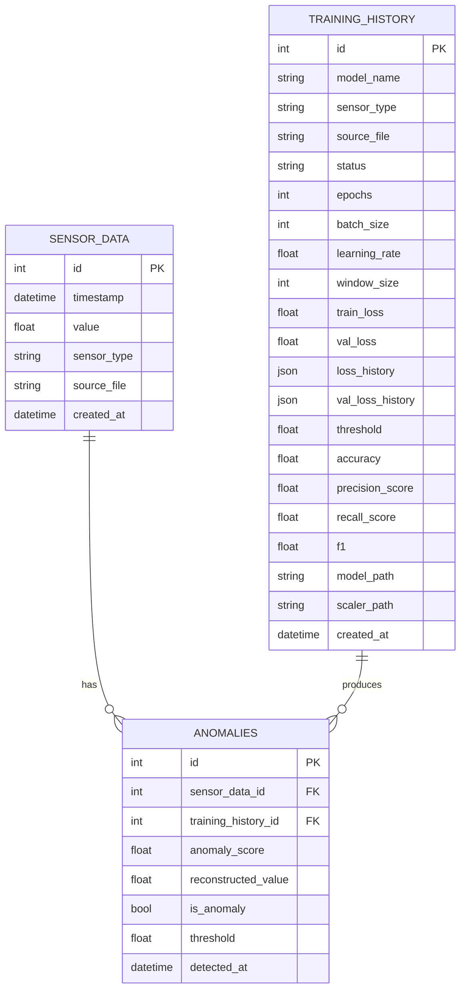
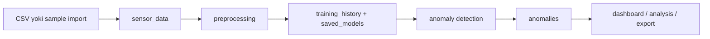

# Data Model

Bu hujjat loyihadagi ma'lumotlar modeli, jadvallar, bog'lanishlar va fayl storage tartibini tushuntiradi.

## 1. Umumiy ko'rinish

Loyihada 3 ta asosiy jadval mavjud:

- `sensor_data`
- `training_history`
- `anomalies`

Qo'shimcha ravishda diskda quyidagi kataloglar ishlatiladi:

- `backend/data/nab/`
- `backend/data/nab_labels/`
- `backend/saved_models/`

## 2. ER diagram

## 3. `sensor_data` jadvali

Bu jadval xom sensor yozuvlarini saqlaydi.

Asosiy maydonlar:

- `id`: birlamchi kalit
- `timestamp`: sensor o'lchov vaqti
- `value`: numeric qiymat
- `sensor_type`: sensor kategoriyasi
- `source_file`: dataset nomi
- `created_at`: yozuv bazaga kirgan vaqt

### Roli

- statistika hisoblash
- training uchun ketma-ketlik yaratish
- chart va jadvallarda xom data ko'rsatish
- anomaly natijalarini real sensor qatori bilan bog'lash

## 4. `training_history` jadvali

Bu jadval model o'qitish natijalarini saqlaydi.

Asosiy maydonlar:

- `model_name`
- `sensor_type`
- `source_file`
- `status`
- `epochs`
- `batch_size`
- `learning_rate`
- `window_size`
- `train_loss`
- `val_loss`
- `loss_history`
- `val_loss_history`
- `threshold`
- `accuracy`
- `precision_score`
- `recall_score`
- `f1`
- `model_path`
- `scaler_path`
- `created_at`

### Roli

- training parametrlarini saqlash
- model sifatini ko'rsatish
- analysis sahifasida model tanlash
- history modal orqali oldingi treninglarni ko'rish

## 5. `anomalies` jadvali

Bu jadval detection natijalarini saqlaydi.

Asosiy maydonlar:

- `sensor_data_id`
- `training_history_id`
- `anomaly_score`
- `reconstructed_value`
- `is_anomaly`
- `threshold`
- `detected_at`

### Roli

- analysis sahifasidagi natijalar
- dashboarddagi recent anomalies
- anomaly CSV export
- statistik summary

## 6. Bog'lanishlar

### `sensor_data -> anomalies`

Har bir anomaly yozuvi bitta sensor qatoriga bog'lanadi.

Bu:

- original timestamp ni qayta olish
- original value ni ko'rsatish
- chartlarda real nuqtani belgilash

uchun kerak.

### `training_history -> anomalies`

Har bir detection ma'lum bir o'qitilgan model bilan bajariladi.

Bu:

- qaysi model natija berganini ko'rsatish
- history va analysis ni bog'lash
- noto'g'ri dataset/model juftligini oldini olish

uchun kerak.

## 7. `source_file` strategiyasi

Loyihadagi eng muhim domen qoidalaridan biri:

- datasetlar `sensor_type` bo'yicha emas
- `source_file` bo'yicha ajratiladi

Sabab:

- `ambient_temperature_system_failure.csv`
- `machine_temperature_system_failure.csv`

ikkalasi ham `temperature` bo'lishi mumkin, lekin ular alohida dataset hisoblanadi.

Shuning uchun:

- data filter
- training
- anomaly detection
- export

hammasi `source_file` ga tayangan holda ishlaydi.

## 8. Fayl storage modeli

### `backend/data/nab/`

Local sample CSV fayllar saqlanadi.

Misollar:

- `ambient_temperature_system_failure.csv`
- `cpu_utilization_asg_misconfiguration.csv`
- `machine_temperature_system_failure.csv`

### `backend/data/nab_labels/`

NAB label fayllari saqlanadi.

Asosiy fayl:

- `combined_windows.json`

Bu fayl mavjud bo'lsa, training yakunida metriclar hisoblanadi.

### `backend/saved_models/`

O'qitilgan model va scaler shu yerga yoziladi.

Tipik fayllar:

- `*.keras`
- `*.joblib`

## 9. Data lifecycle

## 10. Domen qoidalari

- Training faqat tanlangan dataset ustida bajariladi.
- Detection noto'g'ri `training_id + source_file` juftligida rad etiladi.
- Export filterlar asosida ishlaydi.
- Frontend null metric yoki null reconstructed value holatlarida sinmasligi kerak.
- Legacy sample timestamp display qatlamida remap qilinishi mumkin, lekin bazadagi original data o'zgarmaydi.
