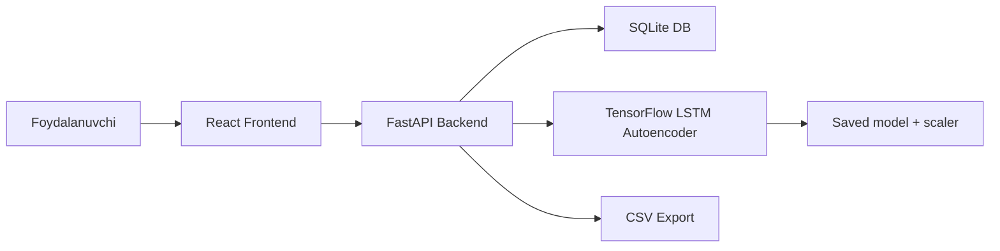

# Diplom Hisoboti Strukturasi

Bu hujjat diplom ishining yozma hisobotini shakllantirish uchun tayyor outline. Bo'limlarni bevosita diplom matniga ko'chirib, har birini kengaytirish mumkin.

## Kirish

Yoritiladigan fikrlar:

- Aqlli uy tizimlarining rivojlanishi.
- Sensorlardan keladigan ma'lumotlarning ko'payishi.
- Vaqt ketma-ketligi ma'lumotlarini avtomatik tahlil qilish zarurati.
- Anomaliya aniqlashning amaliy ahamiyati.
- LSTM Autoencoder tanlanish sababi.

Namunaviy matn:

Aqlli uy tizimlari turli sensorlar orqali doimiy ravishda muhit va qurilmalar holati haqida ma'lumot yig'adi. Ushbu ma'lumotlar odatda vaqt ketma-ketligi ko'rinishida shakllanadi. Sensor qiymatlarida odatiy holatdan keskin chetga chiqish qurilma nosozligi, noto'g'ri konfiguratsiya yoki xavfli holat belgisi bo'lishi mumkin. Shu sababli bunday anomaliyalarni avtomatik aniqlash dolzarb masala hisoblanadi.

## 1-Bob. Nazariy Qism

### 1.1 Vaqt Ketma-ketligi Ma'lumotlari

Yoritiladigan fikrlar:

- Time series tushunchasi.
- Sensor data vaqtga bog'liqligi.
- Ketma-ketlikdagi trend, mavsumiylik va shovqin.
- Real vaqt monitoring tizimlarida time series ahamiyati.

### 1.2 Anomaliya Aniqlash

Yoritiladigan fikrlar:

- Anomaliya nima.
- Point anomaly, contextual anomaly, collective anomaly.
- Sensor tizimlarida anomaly misollari.
- Supervised va unsupervised yondashuvlar.

### 1.3 Autoencoder Algoritmi

Yoritiladigan fikrlar:

- Encoder-decoder arxitekturasi.
- Bottleneck qatlam.
- Reconstruction error tushunchasi.
- Normal data orqali o'rganish.

### 1.4 LSTM Tarmog'i

Yoritiladigan fikrlar:

- RNN va LSTM farqi.
- LSTM vaqtga bog'liq naqshlarni o'rganishi.
- Sensor time series uchun LSTM afzalligi.

## 2-Bob. Loyiha Tahlili va Arxitekturasi

### 2.1 Funktsional Talablar

Talablar:

- CSV dataset yuklash.
- Sensor data saqlash.
- Dataset statistikasini ko'rsatish.
- LSTM Autoencoder modelini o'qitish.
- Training progressni kuzatish.
- Anomaliya aniqlash.
- Dashboardda natijalarni ko'rsatish.
- CSV export qilish.

### 2.2 Nofunktsional Talablar

Talablar:

- Web interfeys responsive bo'lishi.
- Backend API REST uslubida bo'lishi.
- Datasetlar bir-biridan ajratilishi.
- Model va scaler saqlanishi.
- Smoke test orqali asosiy pipeline tekshirilishi.

### 2.3 Umumiy Arxitektura

### 2.4 Ma'lumotlar Bazasi

Jadvallar:

- `sensor_data`
- `training_history`
- `anomalies`

Har bir jadvalning fieldlari va roli `docs/TECHNICAL_OVERVIEW.md` hujjatida batafsil berilgan.

## 3-Bob. Dasturiy Amalga Oshirish

### 3.1 Backend

Yoritiladigan fikrlar:

- FastAPI tanlanish sababi.
- Routerlar: data, model, anomaly, dashboard.
- SQLAlchemy orqali DB bilan ishlash.
- Upload va import endpointlari.
- Background training.
- Export endpointlari.

### 3.2 Machine Learning Pipeline

Yoritiladigan fikrlar:

- CSV o'qish.
- Timestamp va value validatsiyasi.
- MinMax normalization.
- Sliding window.
- Train/test split.
- LSTM Autoencoder training.
- Threshold hisoblash.
- Detection natijalarini DB ga yozish.

### 3.3 Frontend

Yoritiladigan fikrlar:

- React router orqali 4 sahifa.
- Tailwind CSS va shadcn/ui komponentlari.
- TanStack Query va Axios orqali API integratsiyasi.
- Recharts grafiklari.
- Dashboard va Quick Demo.
- Data upload va table.
- Training progress va loss chart.
- Analysis result charts.

## 4-Bob. Tajriba va Natijalar

### 4.1 Dataset

Yoritiladigan fikrlar:

- NAB dataset.
- `timestamp,value` CSV formati.
- realKnownCause sample fayllari.
- label file: `combined_windows.json`.

### 4.2 Tajriba Oqimi

1. Dataset import qilindi.
2. Ma'lumotlar normalizatsiya qilindi.
3. Sliding window yaratildi.
4. LSTM Autoencoder o'qitildi.
5. Reconstruction error hisoblandi.
6. Threshold asosida anomaly flaglandi.
7. Natijalar frontendda ko'rsatildi.

### 4.3 Metriclar

Kiritiladigan jadval:

| Dataset | Accuracy | Precision | Recall | F1 | Anomaly count |
|---|---:|---:|---:|---:|---:|
| ambient_temperature_system_failure.csv | 0.9095 | 1.0000 | 0.0978 | 0.1782 | 78 |

Eslatma: qiymatlar oxirgi training parametrlarga qarab o'zgarishi mumkin.

## Xulosa

Yoritiladigan fikrlar:

- Loyiha maqsadi bajarildi.
- Web ilova ishlab chiqildi.
- LSTM Autoencoder asosida anomaly detection bajarildi.
- Natijalar grafik, jadval va dashboard orqali ko'rsatildi.
- CSV export va smoke test qo'shildi.

## Kelgusidagi Ishlar

Takliflar:

- Real-time streaming sensor data qo'shish.
- Auth va role-based access control qo'shish.
- PostgreSQL yoki TimescaleDB ga o'tkazish.
- Model parametrlarini UI orqali yanada chuqur sozlash.
- Docker deployment qo'shish.
- Ko'proq datasetlar bilan solishtirma tajriba o'tkazish.
