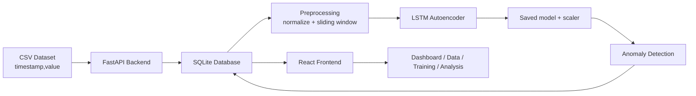
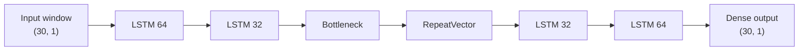

# Texnik Izoh

## 1. Loyiha maqsadi

Loyiha aqlli uy va monitoring sensorlaridan keladigan vaqt ketma-ketligi ma'lumotlarida anomaliyalarni aniqlash uchun ishlab chiqilgan web ilovadir. Asosiy algoritm `LSTM Autoencoder` bo'lib, u normal ketma-ketliklarni qayta tiklashni o'rganadi. Normal holatlarda `reconstruction error` past bo'ladi, anomaliya paytida esa bu xatolik oshadi.

## 2. Tizim arxitekturasi



Loyiha 4 ta asosiy qatlamga bo'linadi:

- ma'lumot qatlami
- backend API qatlami
- ML pipeline qatlami
- frontend vizual qatlam

## 3. Backend modullari

Backend `FastAPI` asosida yozilgan va quyidagi modullardan iborat:

- `app/main.py`: ilovani yaratish, CORS va routerlarni ulash
- `app/config.py`: path, DB va default parametrlar
- `app/database.py`: engine, session va schema sync
- `app/models/db_models.py`: ORM jadvallar
- `app/models/schemas.py`: Pydantic request/response modellari
- `app/routers/data.py`: upload, import, list, stats, sources, sensors, export, delete
- `app/routers/model.py`: training start, status, history, detail
- `app/routers/anomaly.py`: detect, result list, result detail, export, stats
- `app/routers/dashboard.py`: summary endpoint
- `app/services/data_service.py`: CSV parse, DB insert, source list va stats
- `app/services/autoencoder.py`: LSTM Autoencoder model arxitekturasi
- `app/services/anomaly_detector.py`: saved model/scaler bilan detection
- `app/services/evaluation.py`: NAB label asosidagi metric hisoblash
- `app/ml/preprocessing.py`: normalization, windowing, split
- `app/ml/train.py`: Keras training callbacklari
- `app/ml/predict.py`: reconstruction error va threshold bilan ishlash

## 4. Ma'lumotlar modeli

### `sensor_data`

Xom sensor yozuvlarini saqlaydi.

Muhim maydonlar:

- `timestamp`
- `value`
- `sensor_type`
- `source_file`

### `training_history`

Har bir training ishining natijasi va parametrlarini saqlaydi.

Muhim maydonlar:

- `model_name`
- `status`
- `epochs`
- `batch_size`
- `learning_rate`
- `window_size`
- `train_loss`
- `val_loss`
- `loss_history`
- `val_loss_history`
- `threshold`
- `accuracy`
- `precision_score`
- `recall_score`
- `f1`
- `model_path`
- `scaler_path`

### `anomalies`

Detection natijalarini saqlaydi.

Muhim maydonlar:

- `sensor_data_id`
- `training_history_id`
- `anomaly_score`
- `reconstructed_value`
- `is_anomaly`
- `threshold`
- `detected_at`

To'liq jadval tavsifi uchun [DATA_MODEL.md](DATA_MODEL.md) hujjatiga qarang.

## 5. LSTM Autoencoder mantiqi

Autoencoder kiruvchi ketma-ketlikni siqib, keyin qayta tiklashga harakat qiladi.



Training jarayoni:

1. sensor qiymatlari `MinMaxScaler` bilan normallashtiriladi
2. sliding window yordamida ketma-ketliklar tayyorlanadi
3. model `X -> X` shaklida o'qitiladi
4. training errorlari olinadi
5. threshold `mean(error) + k * std(error)` formulasi bilan hisoblanadi

Detection jarayoni:

1. scaler yuklanadi
2. model yuklanadi
3. dataset windowlarga bo'linadi
4. reconstruction error hisoblanadi
5. `error > threshold` bo'lsa anomaly flag qo'yiladi
6. natija `anomalies` jadvaliga yoziladi

## 6. Frontend arxitekturasi

Joriy frontend stack:

- React 18
- TypeScript
- Vite
- Tailwind CSS
- shadcn/ui + Radix UI
- TanStack Query
- Axios
- Recharts
- Sonner

Frontendning asosiy bo'linmalari:

- `/`: Dashboard
- `/data`: ma'lumotlarni boshqarish
- `/training`: model o'qitish
- `/analysis`: anomaly tahlili

Kod strukturasidagi muhim kataloglar:

- `src/pages/`: route-level sahifalar
- `src/components/layout/`: layout, sidebar, health badge
- `src/components/shared/`: reusable UI bloklar
- `src/components/charts/`: Recharts komponentlari
- `src/components/ui/`: shadcn/ui bazaviy komponentlari
- `src/services/api.ts`: HTTP qatlam
- `src/services/types.ts`: typed interfeyslar
- `src/lib/format.ts`: raqam va sana formatlari

## 7. Dataset strategiyasi

Loyihada `source_file` asosiy dataset identifikatori sifatida ishlatiladi. Bu bitta `sensor_type` ichida bir nechta dataset aralashib ketmasligi uchun zarur.

Masalan:

- `ambient_temperature_system_failure.csv`
- `machine_temperature_system_failure.csv`

ikkalasi ham `temperature` bo'lishi mumkin, lekin training va detection alohida datasetga bog'lanadi.

## 8. Training status va monitoring

Training background rejimda ishlaydi.

`GET /api/model/status` orqali quyidagi ma'lumotlar olinadi:

- `state`
- `progress`
- `current_epoch`
- `total_epochs`
- `train_loss`
- `val_loss`
- `loss_history`
- `val_loss_history`

Frontend bu endpointni polling orqali kuzatadi va progress bar hamda loss chartni yangilaydi.

## 9. Baholash va metriclar

Agar `backend/data/nab_labels/combined_windows.json` mavjud bo'lsa, training tugagandan keyin quyidagi metriclar hisoblanadi:

- `accuracy`
- `precision`
- `recall`
- `f1`

Bu qiymatlar:

- training history jadvalida
- detail modalda
- dashboard summary ning `latest_model` qismida

ko'rinishi mumkin.

## 10. Vizual qatlamdagi maxsus qoidalar

- Anomaly chartlarda qizil nuqtalar bilan ko'rsatiladi
- Result jadvallarida anomaly qatorlari alohida fon bilan ajratiladi
- Legacy sample timestamplar frontend display qatlamida hozirgi davrga yaqin ko'rinishda formatlanadi
- Backenddagi original timestamp saqlanib qoladi

## 11. Tekshirish

Automated smoke test:

```bash
backend/.venv311/bin/python scripts/e2e_smoke.py
```

Bu test vaqtinchalik DB bilan quyidagi oqimni tekshiradi:

```text
health -> upload -> stats -> train -> status -> history -> detect -> results -> dashboard -> export
```
